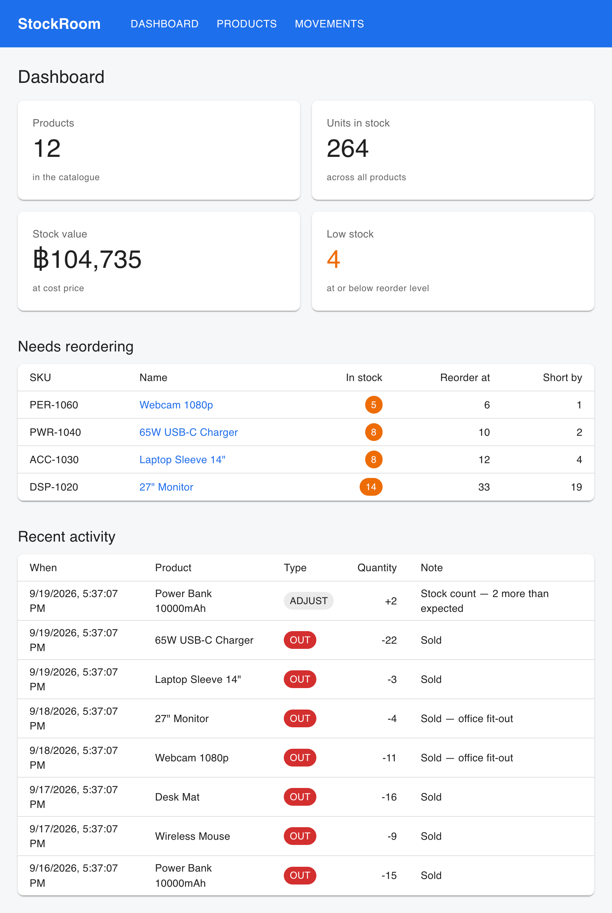

# StockRoom

Inventory and stock management for a small shop or warehouse — track products,
record every stock movement, and see what needs reordering.

**Live demo:** [link]
*(The API is on a free tier and sleeps after 15 minutes of inactivity. The first
request can take up to a minute to wake it.)*



## The problem

built warehouse management and warehouse transfer modules during internship at NK Software House and wanted own version to show show

## Features

- **Products** — catalogue with SKU, category, unit, cost and sale price, and a
  per-product reorder level
- **Stock movements** — record stock in, stock out, and adjustments, each with a
  note, forming a full audit trail
- **Derived stock** — current stock is calculated from the movement ledger, never
  stored (see below)
- **Negative stock prevention** — the API refuses a stock-out larger than what is
  actually in stock, and says how much is available
- **Low stock** — anything at or below its reorder level is flagged in the table
  and listed on the dashboard
- **Dashboard** — product count, total units, stock value at cost, low-stock
  count, a reorder list and recent activity
- **Search and filter** — by name or SKU, by category, or low stock only

## Tech

React 19 · Vite · MUI · React Router · Node · Express · SQLite
**Frontend** React 19 · Vite · Material UI · React Router
**Backend** Node · Express · SQLite (better-sqlite3), hand-written SQL, no ORM

## Key decision: stock is calculated, not stored

- The obvious design is a `quantity` column added to and subtract from.
- This app instead stores every change as a row in `movements`, and
  current stock is the sum of those rows.
- Gain: a full audit trail, no lost updates from two changes at once, and the
  ability to reconstruct stock at any past date.
- Costs: a JOIN and a GROUP BY on every product query instead of
  reading one column.
- computed in SQL for list views to avoid N+1 queries,
  and that the same rule exists as a pure function (`lib/stock.js`) used
  by the write path to prevent negative stock.

## Running it locally

```bash
# server
cd server
npm install
cp .env.example .env
npm run seed        # creates the database and loads sample products
npm run dev         # http://localhost:4000

# client — in a second terminal
cd client
npm install
npm run dev         # http://localhost:5173
```

## Project structure

```
server/
  src/
    index.js        Express app and route mounting
    db.js           opens SQLite, applies schema.sql
    schema.sql      the two tables
    seed.js         sample data
    lib/stock.js    current-stock calculation
    routes/         products, movements, reports
client/
  src/
    api.js          fetch helper used by every page
    pages/          Dashboard, Products, ProductDetail, Movements
    components/     shared UI
```

## What I'd do next

- **Suppliers and purchase orders** — turn the reorder list into an actual order
- **User accounts** — right now anyone with the link can change stock
- **Tests** — the stock calculation and the API validation are the obvious first
  targets
- **CSV export** — the reorder list is the report people actually want to email
- **Multi-warehouse** — movements would gain a location, and stock becomes
  per-location
